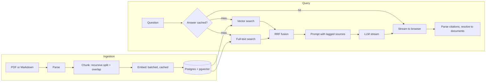

# RAG Wiki

**Ask questions about your own documents and get answers that cite their sources.**

RAG Wiki is a production-shaped Retrieval-Augmented Generation service. Upload a
PDF or Markdown file, ask a question in plain English, and read a streamed
answer where every claim links back to the passage it came from. If the answer
is not in your documents, it says so instead of inventing one.

[**Live demo**](https://ai-research-assistant-six-gamma.vercel.app) · [Architecture](docs/ARCHITECTURE.md) · [API reference](docs/API.md) · [Deployment guide](docs/DEPLOYMENT.md)


---

## Why this project is interesting

Most RAG demos wire an embedding model to a vector store and stop there. The
hard parts are the ones that decide whether the answers are any good, and
whether the thing survives contact with a real deployment. This project takes
positions on those:

| Problem | What this does |
|---|---|
| Vector search misses exact terms; keyword search misses paraphrases | Runs **both** and fuses the rankings with Reciprocal Rank Fusion |
| Combining two searches means combining incomparable scores | RRF fuses **ranks**, not scores, so no per-corpus tuning is needed |
| A chunk boundary can make a fact unretrievable | Recursive splitting on semantic boundaries, with token overlap |
| Models cite sources that do not exist | Citations are parsed from tags the model emitted and resolved against real rows |
| Every question costs money | Three cache tiers, plus a per-IP budget limiter on each paid endpoint |
| A cache outage should not be an outage | Every cache path degrades to a miss; readiness stays green without Redis |
| A cache outage should not be a blank cheque | The budget limiters keep counting in-process rather than failing open |
| Serverless freezes an instance the moment a response ends | Post-response writes are awaited, not fire-and-forget |

---

## How it works



The full walkthrough, including why each decision was made, is in
[docs/ARCHITECTURE.md](docs/ARCHITECTURE.md).

---

## Stack

**Backend** — Node.js, TypeScript (strict, with `noUncheckedIndexedAccess` and
`exactOptionalPropertyTypes`), Express 5, Postgres with pgvector, Redis, Zod for
runtime validation at every boundary, OpenRouter for models.

**Frontend** — React 19, Vite 8, Tailwind CSS 4, streaming over Server-Sent
Events with an incremental parser and animation-frame batched rendering.

**Quality** — Vitest across both packages, ESLint with type-aware rules, GitHub
Actions running typecheck, lint, tests and build on every push, plus CodeQL.

---

## Engineering highlights

**Hybrid retrieval with Reciprocal Rank Fusion.** Two searches run in parallel
over the same corpus. Vector search catches the paraphrase; Postgres full-text
search catches the exact identifier. Their rankings are fused with
`1 / (k + rank)`, summed where both agree. Fusing positions rather than scores
avoids normalising a cosine distance against a `ts_rank`, which are different
quantities with different distributions and no principled common scale.

**Chunking that respects meaning.** A recursive splitter breaks on paragraphs,
then lines, then sentences, then words, and only cuts on raw token boundaries
when nothing else is left. Pieces carry the separator that followed them, so
reassembly reproduces the source text exactly and token counts stay honest.
Overlap between neighbours keeps a fact that straddles a boundary retrievable.

**Citations that cannot be fabricated.** Retrieved chunks enter the prompt
wrapped in `[SOURCE:chunk_id]` tags. The tags in the generated answer are parsed
back out and resolved against the chunk map built during retrieval, so a
citation can only render if it points at a passage that was genuinely supplied.

**Three cache tiers.** Answers for an hour, fused retrieval results for thirty
minutes, embeddings for a day. The embedding cache is shared between ingestion
and querying, so the two paths make each other cheaper. A cache hit is replayed
word by word so it looks identical to a live generation.

**Built for serverless.** One Postgres connection per instance, lazy Redis
connect reused across invocations, a pure-JS tokenizer instead of a WASM build,
and post-response database writes awaited rather than left floating, because a
frozen instance drops any promise still in flight.

**Failure modes chosen deliberately.** Redis down means slower, not broken:
caches miss, the general rate limiter fails open, readiness stays green. The two
budget limiters are the exception — they fall back to an in-process counter,
because an outage making the browsing free is fine and an outage making the
model calls free is not. Postgres down fails readiness with 503 and refuses
startup. Unexpected errors return a generic message with a request id, because
raw messages leak connection strings and upstream payloads.

---

## Running it locally

**Prerequisites** — Node 20+, pnpm 10+, a Postgres database with the `vector`
extension, and a Redis instance. The free tiers of
[Neon](https://neon.tech) and [Upstash](https://upstash.com) both work, and
avoid running anything locally.

```bash
git clone https://github.com/Shafayathub/RAG_Wiki.git
cd RAG_Wiki
pnpm install

cp .env.example .env
# then fill in DATABASE_URL, REDIS_URL and OPENROUTER_API_KEY

pnpm migrate   # create the schema
pnpm seed      # optional: load the demo collection
pnpm dev       # API on :5000, web on :5173
```

Open http://localhost:5173. The Vite dev server proxies `/api/v1` to the
backend, so no CORS configuration is needed for local work.

### Commands

| Command | Does |
|---|---|
| `pnpm dev` | Runs API and web together with hot reload |
| `pnpm verify` | Typecheck, lint, test and build — the same gate CI runs |
| `pnpm test` | Runs both test suites |
| `pnpm test:coverage` | Same, with coverage reports |
| `pnpm migrate` | Applies pending SQL migrations, tracked in `schema_migrations` |
| `pnpm seed` | Loads the demo collection; safe to re-run |
| `pnpm build` | Compiles the API and builds the web bundle |

---

## Deploying

The whole thing runs as a single Vercel project: the React bundle as static
files and the Express app as one serverless function, sharing an origin so no
CORS configuration is needed in production. Postgres comes from Neon and Redis
from Upstash, both on free tiers.

Step-by-step instructions, the environment variables to set, the serverless
constraints that matter (a 4.5MB body cap and a 60 second function limit), and
a fallback topology are in [docs/DEPLOYMENT.md](docs/DEPLOYMENT.md).

---

## Project layout

```
.
├── api/index.ts        Vercel entry point; exports the Express app
├── backend/
│   ├── migrations/     Versioned SQL, applied once and recorded
│   ├── seed/           Markdown that populates the demo collection
│   └── src/
│       ├── config/     Env validation, Postgres, Redis, model client
│       ├── middleware/ Request context, rate limits, admin guard, errors
│       ├── modules/    collections, ingest, query
│       └── utils/      Chunker, embedder, retriever, prompt builder, logger
├── frontend/src/
│   ├── api/            HTTP client and normalised errors
│   ├── components/     Upload panel, chat window, citation drawer, input
│   ├── hooks/          SSE query stream, collection list
│   └── lib/            Incremental SSE parser
├── docs/               Architecture, API reference, deployment guide
└── vercel.json         Build, routing and security headers
```

---

## Testing

110 tests run in CI on every push.

The suites concentrate on the logic where a bug would be invisible in manual
use: RRF fusion ordering, chunk boundary and overlap behaviour, incremental SSE
parsing across arbitrary network chunk splits, error status mapping, the
production leak guard, CORS origin handling, the budget limiter's in-process
fallback, the guard that rejects a short embedding response rather than storing
a gap, and the demo-mode admin guard including timing-safe token comparison.

```bash
pnpm test              # everything
pnpm test:coverage     # with coverage
```

---

## License

MIT — see [LICENSE](LICENSE).
